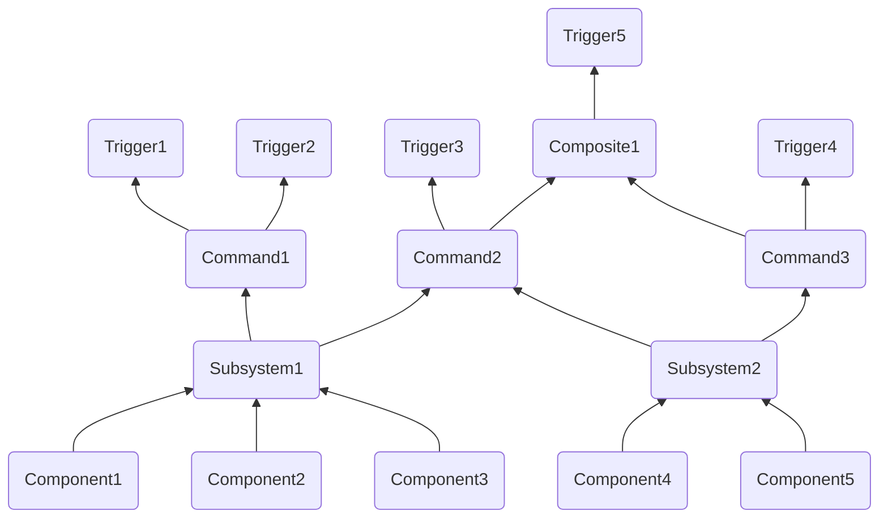

# Command Base Help Document

## Table of Contents:

1. [Commmand Concept Overviews](#command-concept-overviews)
2. [How to make a...](#how-to-make-a)
    1. [Subsystem](#subsystem)
    2. [Command](#command)
    3. [Button Binding](#button-binding)
3. [Decorators](#decorators)
4. [Command Composition](#command-composition)
5. [Autonomous](#autonomous)
6. [Generalized Solenoid Subsystem and Command](#generalized-solenoid-subsystem-and-command)

## Commmand Concept Overviews:

- A **component** is a single device on the robot
    - Accessible via a class either built into wpilib or a [3rd party vendor library](WPILib.md#3rd-party-vendor-libraries) (not user-defined)
    - Lowest level concept we work with
    - Examples: `TalonFX`, solenoid, limit switch
- A **subsystem** is a group of components on the robot
    - The only way to access a component
        - Must contain all functionality needed to interface with the components contained in it
    - Each component should be contained in exactly **one** subsystem
        - Otherwise, the built-in protection against multiple commands being scheduled for one subsystem at once will not properly protect the component (this is handled by [command requirements](https://docs.wpilib.org/en/stable/docs/software/commandbased/commands.html#getrequirements))
    - No components in a subsystem should need to do different tasks at the same time
        - A subsystem can't run multiple commands at once, so even if two tasks require different components and won't interfere, you will need to find a way to have the tasks in the same command or break your subsystem into multiple pieces
        - If you have your drive train in the same subsystem as your shooter, you can't drive and shoot at once, at least not without an extremely confusing and unintuitive command; it's much simpler to have separate subsystems and separate commands for driving and shooting
    - Read more on the subsystem [docs](https://docs.wpilib.org/en/stable/docs/software/commandbased/subsystems.html)
    - Examples: a drivetrain, a shooter, an intake
- A **command** does a task
    - The only way to access subsystems
        - User input (bindings) is abstracted into actions for the robot to do using its various subsystems
    - Handled by the [Command Scheduler](https://docs.wpilib.org/en/stable/docs/software/commandbased/command-scheduler.html), which determines what commands are running when through a system of scheduling a command when a binding is pressed in most cases and descheduling it when it completes or is interrupted
    - Each subsystem can be used in multiple commands
        - WPILib handles conflicts, ensuring that a subsystem doesn't try to do two things at once using [command requirements](https://docs.wpilib.org/en/stable/docs/software/commandbased/commands.html#getrequirements)
        - Each command has a list of requirements, the subsytems that it uses
        - You can make a command non-interruptible, meaning that if another command with a shared requirement is scheduled (or the command is interrupted in some other way), the current command will not be cancelled (interrupted)
            - You can detect if your command was ended due to an interruption using the boolean `interrupted` parameter the command's `End()` method is called with
    - Commands can be formed out of other commands in command grouping, these commands are called compositions
        - There are several different types of command group to control the order that the composed commands are run in, read more [here](https://docs.wpilib.org/en/stable/docs/software/commandbased/command-groups.html)
        - As composites are commands, they can be used in the formation of more composites
    - Read more on the command [docs](https://docs.wpilib.org/en/stable/docs/software/commandbased/commands.html)
    - Examples: drive, shoot out a ball, take in a ball
- A **trigger** is an input that interacts with the command scheduler to control when commands are scheduled and descheduled
    - The most common type of trigger is a button input
        - These can be formed by declaring a `frc2::CommandXboxController` and calling a button method (`A()`, `B()`, `Y()`), then a binding on that (`OnTrue()`, `WhileTrue()`)
        - Ex: `commandXboxControllerObject.A().OnTrue([CommandPtrToBind]))`
    - Commands are generally bound to triggers in the `ConfigureButtonBindings` class of `RobotContainer`
    - Alternatively, you can make [custom triggers](https://docs.wpilib.org/en/stable/docs/software/commandbased/binding-commands-to-triggers.html#arbitrary-triggers), which, rather than being a button input, take a boolean value that you provide
        - Example: `frc2::Trigger([&objectYourBoolIsIn] { return objectYourBoolIsIn.GetBoolValue(); }).Binding(Command(&subsystem).ToPtr(););`
    - There are different [bindings](https://docs.wpilib.org/en/stable/docs/software/commandbased/binding-commands-to-triggers.html#trigger-bindings) available, which allow for different logical connections between triggers and commands
        - First, you make a trigger (such as a button), then call a binding on it, then place your command in the form of a `CommandPtr` as the argument for the binding
    - Triggers can be [composed](https://docs.wpilib.org/en/stable/docs/software/commandbased/binding-commands-to-triggers.html#composing-triggers) so that `&&`, `||`, or `!` can be applied to them
    - Bindings return the original trigger, so you can [chain together bindings](https://docs.wpilib.org/en/stable/docs/software/commandbased/binding-commands-to-triggers.html#chaining-calls)
    - Read more on the [docs](https://docs.wpilib.org/en/stable/docs/software/commandbased/binding-commands-to-triggers.html)



## How to make a...

The following section covers how to write a new subsytem and command, and how to bind a command to a trigger. All file paths are in the `src > main` directory.

### Subsystem:

1. Create your files: you'll need a `SubsystemName.h` file in the `include > subsystems` directory, and a `SubsytemName.cpp` file in the `cpp > subsystems` directory. (from now on, `SubsystemName` represents the name of the subsystem, your name should be CamelCase)

2. In `SubsystemName.h` declare methods and components:
```C++
#pragma once

#include <frc2/command/SubsystemBase.h>

class SubsystemName : public frc2::SubsystemBase {
public:
    SubsytemName(); //Constructor

    //Method declarations go here:
    void ExampleMethod1(); //Declare your own methods like so
    double ExampleMethod2(double exampleParameter);

private:
    //subsystem components such as motors:
    WPI_TalonFX exampleTalonFX;
    WPI_TalonSRX exampleTalonSRX;
};
```

3. In `SubsytemName.cpp` define methods and components:
```C++
#include "subsystems/SubsytemName.h"

SubsytemName::SubsytemName() : exampleTalonFX{0}, exampleTalonSRX{1} {} //constructor, make sure to include all components with their ids, separated by commas

void SubsytemName::ExampleMethod1() {
  exampleTalonFX.Set(0.5);
}

double SubsytemName::ExampleMethod2(double exampleParameter) {
  exampleTalonSRX.Set(exampleParameter);
  return 5;
}
```

4. In `RobotContainer.h` (in the `include` directory), make a pointer to your subsystem:
```C++
#pragma once

#include <frc2/command/Command.h>
#include <frc/XboxController.h>

#include "subsystems/SubsytemName.h"

class RobotContainer {
 public:
  RobotContainer();
  
 private:
  frc::XboxController controller{0}; //controller used for bindings
  
  SubsytemName subsytemName; //uses pascalCase as it is an instance

  void ConfigureButtonBindings();
};
```

### Command:

1. Ensure you need a command, a command should *do* something, interface with subsystem(s), and is generally scheduled by a button press.

2.  Create your files: you'll need a `CommandName.h` file in the `include > commands` directory, and a `CommandName.cpp` file in the `cpp > commands` directory. (from now on, `CommandName` represents the name of the command, your name should be CamelCase)

3. In `CommandName.h`, declare constructor and methods you plan to use:
```C++
#pragma once

#include <frc2/command/CommandBase.h>
#include <frc2/command/CommandHelper.h>

#include "subsystems/SubsytemName.h" //Subsystem requirements, each should have its own include

class CommandName : public frc2::CommandHelper<frc2::CommandBase, CommandName> {
 public:
  explicit CommandName(SubsytemName* subsystem); //constructor, must take all required subsystems as parameters

    void Initialize() override; //Called once at the beginning, defaults to nothing
  
    //void Execute() override; //Called every frame, defaults to nothing

    void End(bool interrupted) override; //Called once at the end, defaults to nothing
  
    //bool IsFinished() override; //return whether the command has finished, run once per frame, defaults to false (no end until interrupt)
	
 private:
  SubsytemName* subsytemName; //each subsystem needs its own pointer
};
```

4. In `CommandName.cpp`, define methods and constructor:
```C++
#include "commands/CommandName.h"

CommandName::CommandName(SubsytemName* subsystem) : subsystemName(subsystem) { //constructor, takes all required subsystems and adds them to command requirements
	AddRequirements(subsystem); //subsystems must be added to the command's requirements
}

void CommandName::Initialize() {
	subsytemName->ExampleMethod1();
	subsytemName->ExampleMethod2(0.5);
}

/*void CommandName::Execute() {
    subsystemName->ExampleMethod1(); 
}*/

void CommandName::End(bool interrupted) {
	subsytemName->ExampleMethod2(0.5);
}

/*bool SpinTfx::IsFinished() { //return whether the command should finish this frame

}*/
```

### Button Binding:

1. Ensure that you have "`frc::XboxController controller{0};`" and "`void ConfigureButtonBindings();`" under `private:` in `RobotContainer.h` (you'll need to include `<frc/XboxController.h>`). This instantiates a controller to use for bindings and declares the class for button bindings respectively.

2. In `RobotContainer.cpp`, declare your button bindings (read the [docs](https://docs.wpilib.org/en/stable/docs/software/commandbased/binding-commands-to-triggers.html#trigger-button-bindings) to find the correct binding for the functionality you want to acheive):
```C++
#include "RobotContainer.h"

#include <frc2/command/button/JoystickButton.h>
#include <frc/XboxController.h> //used for enumerators

using frc::XboxController;
using namespace frc2;

RobotContainer::RobotContainer() {
  ConfigureButtonBindings();
}

void RobotContainer::ConfigureButtonBindings() {
    // Configure your button bindings to commands here
	JoystickButton(&controller, XboxController::Button::kA).WhenHeld(CommandName{&subsystemName}); //declare a joystick button using the enumerator of the a button of `controller` (remember the &), then call `.WhenHeld()`, a binding that schedules the command when you hit the button and cancels it when you release it, `.WhenHeld()` takes a command, which takes subsytem pointers according to its constructor, the subsytems should be declared in the header already

    JoystickButton(&controller, XboxController::Button::kB)
        .WhenActive(CommandName{&subsytemName})
        .WhileHeld(CommandName2{&subsystemName}); //bindings return the original button, so they can be chained together

    (JoystickButton(&controller, XboxController::Button::kX)
        || JoystickButton(&controller, XboxController::Button::kY))
        .WhileActiveOnce(CommandName{&subsystemName}); //trigger composition, if either is pressed, CommandName will be scheduled (must use WhileActiveOnce() rather than whenHeld() because composition returns a trigger, not a button)
}
```

## Decorators:

Decorators are a sort of addon to any commands you may have that are applied during binding. They add additional functionality, such as ending a command after a certain amount of time. They can be used by including `<frc2/command/ParallelRaceGroup.h>`, which is their return type, and calling the decorator method on the command of choice inside of the binding method. So, for example:
```C++
JoystickButton(&controller, XboxController::Button::kY).WhenActive(ToggleSolenoid{&solenoidSubsystem}.WithTimeout(3_ms));
```
One of the more useful decorators is `WithTimeout()`, which takes a `units::second_t` as a perameter. To use this, you'll need the `<units/time.h>` header. Read more about types of decorators on the [docs](https://docs.wpilib.org/en/stable/docs/software/commandbased/convenience-features.html#command-decorator-methods).

## Command Composition:

Command can be made using other commands. This is called command composition. There are two main options: the `SequentialCommandGroup`, which runs each command one after another, and the `ParallelCommandGroup`, which runs all the commands at the same time. There are also two other types of `ParallelCommandGroup` which are used for more specific use cases (read more on the [docs](https://docs.wpilib.org/en/stable/docs/software/commandbased/command-groups.html#types-of-command-groups)). If you need a more complex command structure, it can be built by composing command compositions, making command groups out of command groups. Commands can be composed like so:  

`ComposedCommandName.h`:
```C++
#pragma once

#include <frc2/command/CommandHelper.h>
#include <frc2/command/SequentialCommandGroup.h> //or any other command group

#include "Command1.h"
#include "Command2.h"
#include "Command3.h"

class ComposedCommandName : public frc2::CommandHelper<frc2::SequentialCommandGroup, ComposedCommandName> {
public:
	ComposedCommandName(SubsystemName* subsystem);

private:
	SubsystemName* subsystemName;
};
```

`ComposedCommandName.cpp`:
```C++
#include "commands/ComposedCommandName.h"

ComposedCommandName::ComposedCommandName(Motors* subsystem) : subsystemName(subsystem) {
	AddCommands(Command1{subsystemName}, Command2{subsystemName}, Command3{subsystemName});
}
```

Commands can also be composed inline, however this is more difficult. Read more about it here: [docs](https://docs.wpilib.org/en/stable/docs/software/commandbased/command-groups.html#inline-command-groups).

## Autonomous:

This guide is based off of this one: [guide](https://docs.wpilib.org/en/stable/docs/software/dashboards/smartdashboard/choosing-an-autonomous-program-from-smartdashboard.html).
1. Include `<frc/smartdashboard/SendableChooser.h>`
2. In `RobotContainer.h` `private`, declare a variable of `SendableChooser`, which is able to be sent to the dashboard and allows you to choose an option from a list during runtime: `frc::SendableChooser<frc2::Command*> autonomousChooser;`
3. Declare a variable of each command you would like to add to the chooser: `CommandName1 commandName1{&subsystemName};` (subsystemName must already be declared)
4. In the `RobotContainer.cpp` constructor, set your default command and add the others:
	- For the first command, use `SetDefaultOption()`: `autonomousChooser.SetDefaultOption("Display Name", &commandName1);`\
	- For all others, use `AddOption()`: `autonomousChooser.AddOption("Display Name", &commandName2);`
5. Put this method at the end of your `RobotContainer.cpp` (remember the corrosponding public `frc2::Command* GetAutonomousCommand();` in the header): 
```C++
frc2::Command* RobotContainer::GetAutonomousCommand() {
return autonomousChooser.GetSelected();
}
```
6. In `Robot.cpp` `AutonomousInit()` schedule the command if it is available (remember public `void AutonomousInit() override;`in `Robot.h`): 
```C++
void Robot::AutonomousInit() {
  autonomousCommand = robotContainer.GetAutonomousCommand();

  if (autonomousCommand != nullptr) {
    autonomousCommand->Schedule();
  }
}
```
7. Check that the scheduler is called in `RobotPeriodic()` (`Robot.cpp`):
```C++
void Robot::RobotPeriodic() {
	frc2::CommandScheduler::GetInstance().Run();
}
```
8. Cancel the autonomous command in `TeleopInit()`:
```C++
void Robot::TeleopInit() {
	if (autonomousCommand != nullptr) {
		autonomousCommand->Cancel();
		autonomousCommand = nullptr;
	}
}
```

## Generalized Solenoid Subsystem and Command

Most double solenoids should be able to function using basically the same subsystem and command, though you may want to add the solenoid to another subsystem in some cases. Below is a general use command and subsystem in order to toggle a solenoid.  
> **IMPORTANT: The below command must be bound to a trigger with the `WithTimeout(3_ms)` decorator. Failure to do so may result in damage to the solenoid and a nonfunctional command.**

`SubsystemName.h`:
```C++
#pragma once

#include <frc2/command/SubsystemBase.h>
#include <frc/DoubleSolenoid.h>

class SubsystemName : public frc2::SubsystemBase {
public:
	SubsystemName();

	void SetPosition(frc::DoubleSolenoid::Value position);
	frc::DoubleSolenoid::Value GetPosition();

private:
 	frc::DoubleSolenoid solenoidName; //it is ill-advised to name your solenoid `solenoid`, as it may not interact well with wpilib
};
```

`SubsystemName.cpp`:
```C++
#include "subsystems/SubsystemName.h"

SubsystemName::SubsystemName() : solenoidName{frc::PneumaticsModuleType::CTREPCM, [reverseId], [forwardId]} {} //declares the solenoid to use ctre control and the two provided ids as ints. Generally the smaller number should go first, test to see what works correctly.

void SubsystemName::SetPosition(frc::DoubleSolenoid::Value position) {
	solenoidName.Set(position);
}

frc::DoubleSolenoid::Value SubsystemName::GetPosition() {
	return solenoidName.Get();
}
```

`CommandName.h`(name should probably mention toggling the solenoid):
```C++
#pragma once

#include <frc2/command/CommandBase.h>
#include <frc2/command/CommandHelper.h>

#include "subsystems/SubsystemName.h"

class CommandName : public frc2::CommandHelper<frc2::CommandBase, CommandName> {
public:
	explicit CommandName(SubsystemName* subsystem);

	void Initialize() override;
	void End(bool interrupted) override;

private:
	SubsystemName* subsystemName;
	frc::DoubleSolenoid::Value currentPosition;
};
```

`CommandName.cpp`:
```C++
#include "commands/CommandName.h"
#include <frc/smartdashboard/SmartDashboard.h>

CommandName::CommandName(SubsystemName* subsystem) : subsystemName(subsystem) {
	AddRequirements(subsystem);
	currentPosition = frc::DoubleSolenoid::Value::kReverse; //set the initial position to retracted
}

void CommandName::Initialize() {
	if (currentPosition == frc::DoubleSolenoid::Value::kReverse) {
		SubsystemName->SetPosition(frc::DoubleSolenoid::Value::kForward);
		currentPosition = frc::DoubleSolenoid::Value::kForward;
	}
	else { //if not reverse, set to reverse
		SubsystemName->SetPosition(frc::DoubleSolenoid::Value::kReverse);
		currentPosition = frc::DoubleSolenoid::Value::kReverse;
	}
}

void CommandName::End(bool interrupted) { //should be called 3 ms after `Initialize()`
	SubsystemName->SetPosition(frc::DoubleSolenoid::Value::kOff);
}
```
