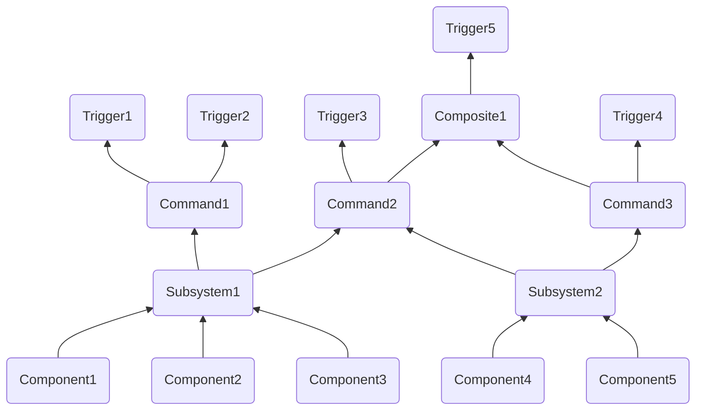

# Command Base Help Document

## Table of Contents:

1. [Commmand Concept Overviews](#command-concept-overviews)
2. [How to make a...](#how-to-make-a)
    1. [Subsystem](#subsystem)
    2. [Command](#command)
    3. [Button Binding](#button-binding)
3. [Decorators](#decorators)
4. [Command Composition](#command-composition)
5. [Autonomous](#autonomous)
6. [Generalized Solenoid Subsystem and Command](#generalized-solenoid-subsystem-and-command)

## Commmand Concept Overviews:

- A **component** is a single device on the robot
    - Accessible via a class either built into wpilib or a [3rd party vendor library](WPILib.md#3rd-party-vendor-libraries) (not user-defined)
    - Lowest level concept we work with
    - Examples: `TalonFX`, solenoid, limit switch
- A **subsystem** is a group of components on the robot
    - The only way to access a component
        - Must contain all functionality needed to interface with the components contained in it
    - Each component should be contained in exactly **one** subsystem
        - Otherwise, the built-in protection against multiple commands being scheduled for one subsystem at once will not properly protect the component (this is handled by [command requirements](https://docs.wpilib.org/en/stable/docs/software/commandbased/commands.html#getrequirements))
    - No components in a subsystem should need to do different tasks at the same time
        - A subsystem can't run multiple commands at once, so even if two tasks require different components and won't interfere, you will need to find a way to have the tasks in the same command or break your subsystem into multiple pieces
        - If you have your drive train in the same subsystem as your shooter, you can't drive and shoot at once, at least not without an extremely confusing and unintuitive command; it's much simpler to have separate subsystems and separate commands for driving and shooting
    - Read more on the subsystem [docs](https://docs.wpilib.org/en/stable/docs/software/commandbased/subsystems.html)
    - Examples: a drivetrain, a shooter, an intake
- A **command** does a task
    - The only way to access subsystems
        - User input (bindings) is abstracted into actions for the robot to do using its various subsystems
    - Handled by the [Command Scheduler](https://docs.wpilib.org/en/stable/docs/software/commandbased/command-scheduler.html), which determines what commands are running when through a system of scheduling a command when a binding is pressed in most cases and descheduling it when it completes or is interrupted
    - Each subsystem can be used in multiple commands
        - WPILib handles conflicts, ensuring that a subsystem doesn't try to do two things at once using [command requirements](https://docs.wpilib.org/en/stable/docs/software/commandbased/commands.html#getrequirements)
        - Each command has a list of requirements, the subsytems that it uses
        - You can make a command non-interruptible, meaning that if another command with a shared requirement is scheduled (or the command is interrupted in some other way), the current command will not be cancelled (interrupted)
            - You can detect if your command was ended due to an interruption using the boolean `interrupted` parameter the command's `End()` method is called with
    - Commands can be formed out of other commands in command grouping, these commands are called compositions
        - There are several different types of command group to control the order that the composed commands are run in, read more [here](https://docs.wpilib.org/en/stable/docs/software/commandbased/command-groups.html)
        - As composites are commands, they can be used in the formation of more composites
    - Read more on the command [docs](https://docs.wpilib.org/en/stable/docs/software/commandbased/commands.html)
    - Examples: drive, shoot out a ball, take in a ball
- A **trigger** is an input that interacts with the command scheduler to control when commands are scheduled and descheduled
    - The most common type of trigger is a button input
        - These can be formed by declaring a `frc2::CommandXboxController` and calling a button method (`A()`, `B()`, `Y()`), then a binding on that (`OnTrue()`, `WhileTrue()`)
        - Ex: `commandXboxControllerObject.A().OnTrue([CommandPtrToBind]))`
    - Commands are generally bound to triggers in the `ConfigureButtonBindings` class of `RobotContainer`
    - Alternatively, you can make [custom triggers](https://docs.wpilib.org/en/stable/docs/software/commandbased/binding-commands-to-triggers.html#arbitrary-triggers), which, rather than being a button input, take a boolean value that you provide
        - Example: `frc2::Trigger([&objectYourBoolIsIn] { return objectYourBoolIsIn.GetBoolValue(); }).Binding(Command(&subsystem).ToPtr(););`
    - There are different [bindings](https://docs.wpilib.org/en/stable/docs/software/commandbased/binding-commands-to-triggers.html#trigger-bindings) available, which allow for different logical connections between triggers and commands
        - First, you make a trigger (such as a button), then call a binding on it, then place your command in the form of a `CommandPtr` as the argument for the binding
    - Triggers can be [composed](https://docs.wpilib.org/en/stable/docs/software/commandbased/binding-commands-to-triggers.html#composing-triggers) so that `&&`, `||`, or `!` can be applied to them
    - Bindings return the original trigger, so you can [chain together bindings](https://docs.wpilib.org/en/stable/docs/software/commandbased/binding-commands-to-triggers.html#chaining-calls)
    - Read more on the [docs](https://docs.wpilib.org/en/stable/docs/software/commandbased/binding-commands-to-triggers.html)



## How to make a...

The following section covers how to write a new subsytem and command, and how to bind a command to a trigger. All file paths are in the `src > main` directory.

### Subsystem:

1. Create your files: you'll need a `include/subsystems/SubsystemName.h` file and a `cpp/subsystems/SubsytemName.cpp` file. (from now on, `SubsystemName` represents the name of your subsystem)

2. In `SubsystemName.h` declare methods and components:
```C++
#pragma once

#include <frc2/command/SubsystemBase.h>
#include <ctre/Phoenix.h>

class SubsystemName : public frc2::SubsystemBase {
public:
    SubsytemName(); //Constructor

    //Method declarations go here:
    void ExampleMethod1(); //Declare your own methods like so
    void ExampleMethod2(double exampleParameter);

private:
    //subsystem components such as motors:
    WPI_TalonFX exampleTalonFX;
    WPI_TalonSRX exampleTalonSRX;
};
```

3. In `SubsytemName.cpp` define methods and components:
```C++
#include "subsystems/SubsytemName.h"

SubsytemName::SubsytemName() : exampleTalonFX{0}, exampleTalonSRX{1} {} //constructor, make sure to include all components with their constructor arguments

void SubsytemName::ExampleMethod1() {
  exampleTalonFX.Set(0.5);
}

void SubsytemName::ExampleMethod2(double exampleParameter) {
  exampleTalonSRX.Set(exampleParameter);
}
```

4. In `include/RobotContainer.h`, declare your subsystem:
```C++
#pragma once

#include <frc2/command/Command.h>
#include <frc2/command/button/CommandXboxController.h>

#include "subsystems/SubsytemName.h" //add this line

class RobotContainer {
public:
    RobotContainer();
  
private:
  	frc2::CommandXboxController controller{0}; //controller used for bindings
  
    SubsytemName subsytemName; //use pascalCase for the instance

    void ConfigureButtonBindings();
};
```

### Command:

1. Create your files: you'll need a `include/commands/CommandName.h` file and a `cpp/commands/CommandName.cpp` file. (from now on, `CommandName` represents the name of your command)

2. In `CommandName.h`, declare constructor and methods you plan to use:
```C++
#pragma once

#include <frc2/command/CommandBase.h>
#include <frc2/command/CommandHelper.h>

#include "subsystems/SubsytemName.h" //Subsystem requirement

class CommandName : public frc2::CommandHelper<frc2::CommandBase, CommandName> {
public:
    explicit CommandName(SubsytemName* subsystem); //constructor, it must take all required subsystems as parameters

    void Initialize() override; //Called once at the beginning, defaults to doing nothing
  
    //void Execute() override; //Called every frame that the command is scheduled, defaults to doing nothing

    void End(bool interrupted) override; //Called once at the end, defaults to doing nothing, `interrupted` parameter tells whether the commmand was ended because it was interrupted
  
    //bool IsFinished() override; //you return whether the command has completed, run once per frame that the command is scheduled, defaults to false (no end until interrupted)

private:
    SubsytemName* subsytemName; //each subsystem used needs its own pointer
};
```

3. In `CommandName.cpp`, define methods and constructor:
```C++
#include "commands/CommandName.h"

CommandName::CommandName(SubsytemName* subsystem) : subsystemName(subsystem) { //constructor, takes all required subsystems and adds them to command requirements and instance variables
	AddRequirements(subsystem); //subsystems must be added to the command's requirements
}

void CommandName::Initialize() {
	subsytemName->ExampleMethod1();
	subsytemName->ExampleMethod2(0.5);
}

/*void CommandName::Execute() {
    subsystemName->ExampleMethod1(); 
}*/

void CommandName::End(bool interrupted) {
	subsytemName->ExampleMethod2(0);
}

/*bool SpinTfx::IsFinished() { //return whether the command should finish this frame

}*/
```

### Button Binding:

1. Ensure that you have "`frc2::CommandXboxController controller{0};`" and "`void ConfigureButtonBindings();`" under `private:` in `RobotContainer.h` (you'll need to include `<frc2/command/button/CommandXboxController.h>`). This instantiates a controller to use for button triggers and declares the method used for bindings.

2. In `RobotContainer.cpp`, declare your button bindings (read the [docs](https://docs.wpilib.org/en/stable/docs/software/commandbased/binding-commands-to-triggers.html#trigger-bindings) to find the correct binding for the functionality you want to achieve):
```C++
#include "RobotContainer.h"

#include <frc2/command/button/JoystickButton.h>

using namespace frc2;

RobotContainer::RobotContainer() {
  ConfigureButtonBindings();
}

void RobotContainer::ConfigureButtonBindings() {
    // bind your button triggers to commands here
	controller.A().WhileTrue(CommandName(&subsystemName).ToPtr()); //declare a gamepad button trigger by calling the method named for the button you want on the controller, then call a binding on that, such as `WhileTrue()`, which schedules the command when you hit the button and deschedules it when you release it. The binding takes a `CommandPtr`, which you can make by declaring a command (which takes a subsytem instance with an "&" as the parameter), then calling `ToPtr()` or a decorator on it.

    controller.B()
        .OnTrue(CommandName(&subsytemName).ToPtr())
        .WhileTrue(Command2Name(&subsystemName).ToPtr()); //bindings return the original trigger, so bindings can be chained together

    (controller.X() || controller.Y()).WhileFalse(CommandName(&subsystemName).ToPtr()); //trigger composition, if neither are pressed, the command `CommandName` will be scheduled
}
```

## Decorators:

Decorators are a feature of WPILib that allow you to add additional functionality to commands during binding. They can be used by calling the decorator method on the command of choice inside of the binding method. So, for example:
```C++
Jcontroller.Y().WhileTrue(ToggleSolenoid(&solenoidSubsystem).WithTimeout(3_s));
```
Read more about types of decorators on the [docs](https://docs.wpilib.org/en/stable/docs/software/commandbased/command-compositions.html#composition-types).

## Command Composition:

Commands can be made by combining other commands using command composition. There are two main types of command groups: the *Sequence*, which runs a list of commands in sequence, and the *Parallel*, which runs a list of commands at the same time, provided they don't share any requirements (there are also two sub-types of parallel command group, listed [here](https://docs.wpilib.org/en/stable/docs/software/commandbased/command-compositions.html#parallel)). If you need a more complex command structure, it can be built by composing command compositions, since command groups are themselves commands, they can be be composed into more command groups. Commands can be composed together by including `<frc2/command/Commands.h>` and then calling the factory for the group you want from `frc2::cmd` in `RobotContainer.cpp`:  
```cpp
controller.A().WhileTrue(frc2::cmd::Parallel(std::move(command1), std::move(command2), std::move(command3)));
controller.B().OnTrue(frc2::cmd::Sequence(std::move(command1), std::move(command2)));
```

Each command included in the composition needs to have `std::move` called on it from the `<utility>` library.

## Autonomous:

This guide is based off of [this one](https://docs.wpilib.org/en/stable/docs/software/dashboards/smartdashboard/choosing-an-autonomous-program-from-smartdashboard.html#command-based) from the smartdashboard docs.  
> ***Note:** Decorators and inline commands are not supported for autonomous because the sendable chooser does not take CommandPtrs, define commands you need for autonomous in their own files (including compositions)*
1. In `RobotContainer.h`, include `<frc/smartdashboard/SendableChooser.h>`and declare a private `SendableChooser` object, which is able to be sent to the smartdashboard as a list of options:
    ```C++
    frc::SendableChooser<frc2::Command*> autonomousChooser;
    ```
2. Declare a private object for each command you would like to be available as an autonomous routine (subsystem object must already be declared): 
    ```C++
    Command1Name command1Name{&subsystemName};
    ```
3. Declare a public method to be accessed by `robot.cpp` that returns the currently selected autonomous command:
    ```C++
    frc2::Command* GetAutonomousCommand();
    ```
4. In `RobotContainer.cpp`, in the constructor, set your default command and add the others:
	- For the first command, call `SetDefaultOption()`:
        ```C++
        autonomousChooser.SetDefaultOption("Display Name", &command1Name);
        ```
	- For all other commands, call `AddOption()`:
        ```C++
        autonomousChooser.AddOption("Display Name", &commandName2);
        ```
5. Define `GetAutonomousCommand()` to return the currently selected autonomous command at the end of `RobotContainer.cpp`:
    ```C++
    frc2::Command* RobotContainer::GetAutonomousCommand() {
        return autonomousChooser.GetSelected();
    }
    ```
6. In `Robot.h`, publicly override `AutonomousInit()` and `TeleopInit()`:
    ```C++
    void AutonomousInit() override;
    void TeleopInit() override;
    ```
7. In `Robot.cpp`, schedule the command if there is one selected in `AutonomousInit()`:
    ```C++
    void Robot::AutonomousInit() {
        autonomousCommand = robotContainer.GetAutonomousCommand();

        if (autonomousCommand != nullptr) {
            autonomousCommand->Schedule();
        }
    }
    ```
8. Cancel the autonomous command when teleoperated mode begins in `TeleopInit()`:
    ```C++
    void Robot::TeleopInit() {
        if (autonomousCommand != nullptr) {
            autonomousCommand->Cancel();
            autonomousCommand = nullptr;
        }
    }
    ```

## Generalized Solenoid Subsystem and Command

Most double solenoids should be able to function using basically the same subsystem and command, though you may need to add the solenoid to another subsystem in some cases. Below is a general use command and subsystem for toggling a solenoid.  
> **IMPORTANT: The below command must be bound with the `WithTimeout(3_ms)` decorator. Failure to do so may result in damage to the solenoid.**

`SolenoidSubsystem.h`:
```C++
#pragma once

#include <frc2/command/SubsystemBase.h>
#include <frc/DoubleSolenoid.h>
#include <frc/PneumaticHub.h>

class SolenoidSubsystem : public frc2::SubsystemBase {
public:
	SolenoidSubsystem();

	void SetPosition(frc::DoubleSolenoid::Value position);
	frc::DoubleSolenoid::Value GetPosition();

private:
	frc::PneumaticHub hub{0};
 	frc::DoubleSolenoid solenoid = hub.MakeDoubleSolenoid(0, 1);
};
```

`SolenoidSubsystem.cpp`:
```C++
#include "subsystems/SolenoidSubsystem.h"

SolenoidSubsystem::SolenoidSubsystem() {
    hub.EnableCompressorDigital();
}

void SolenoidSubsystem::SetPosition(frc::DoubleSolenoid::Value position) {
	solenoid.Set(position);
}

frc::DoubleSolenoid::Value SolenoidSubsystem::GetPosition() {
	return solenoid.Get();
}
```

`ToggleSolenoid.h`:
```C++
#pragma once

#include <frc2/command/CommandBase.h>
#include <frc2/command/CommandHelper.h>

#include "subsystems/SolenoidSubsystem.h"

class ToggleSolenoid : public frc2::CommandHelper<frc2::CommandBase, ToggleSolenoid> {
public:
	explicit ToggleSolenoid(SolenoidSubsystem* subsystem);

	void Initialize() override;
	void End(bool interrupted) override;

private:
	SolenoidSubsystem* solenoidSubsystem;
	frc::DoubleSolenoid::Value currentPosition;
};
```

`ToggleSolenoid.cpp`:
```C++
#include "commands/ToggleSolenoid.h"

ToggleSolenoid::ToggleSolenoid(SolenoidSubsystem* subsystem) : solenoidSubsystem(subsystem) {
	AddRequirements(subsystem);
	currentPosition = solenoidSubsystem->GetPosition(); //set the initial position to whatever the solenoid is currently at
}

void ToggleSolenoid::Initialize() {
	if (currentPosition == frc::DoubleSolenoid::Value::kReverse) { //if reverse, set to forward
		SolenoidSubsystem->SetPosition(frc::DoubleSolenoid::Value::kForward);
		currentPosition = frc::DoubleSolenoid::Value::kForward;
	}
	else { //if not reverse, set to reverse
		SolenoidSubsystem->SetPosition(frc::DoubleSolenoid::Value::kReverse);
		currentPosition = frc::DoubleSolenoid::Value::kReverse;
	}
}

void ToggleSolenoid::End(bool interrupted) { //should be called 3 ms after `Initialize()` using `WithTimeout()` decorator
	SolenoidSubsystem->SetPosition(frc::DoubleSolenoid::Value::kOff); //set the solenoid to off, the piston will remain where it was last set to
}
```
