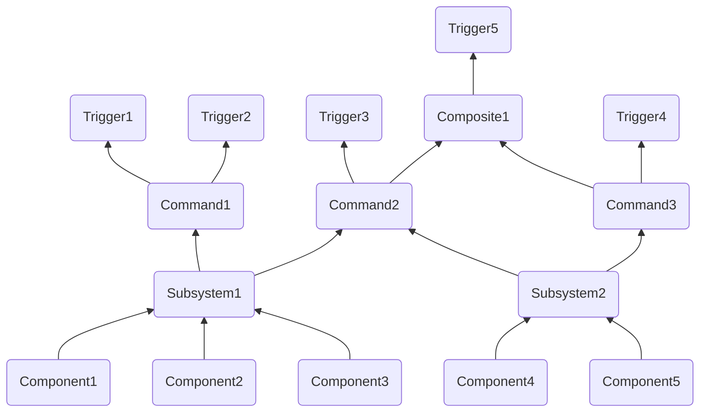

# Command Base Help Document
## Concept Overviews:
- A **component** is a single device on the robot
    - Accessible by a class either built into wpilib or a [3rd party vendor library](Help.md#3rd-party-vendor-libraries) (not user-defined)
    - Lowest level class we work with
    - Examples: `TalonFX`, solenoid, input device such as CANcoder or limit switch
- A **subsystem** is a specific section of the robot, it's used as an interface between components and commands
    - Contains component(s)
    - The only way to access a component, therefore, must contain all of the functionality needed to interface with all components contained by it
    - Each component should be contained in exactly **one** subsystem
        - Otherwise, the built-in protection against multiple values being sent to one subsystem at the same time won't work right (this is handled by the [command scheduler](https://docs.wpilib.org/en/stable/docs/software/commandbased/command-scheduler.html))
    - All components in one subsystem should be used at the same time most of the time 
        - A subsystem can't do multiple things at once, so if you have your drive train in the same subsystem as your shooter, you can't drive and shoot at once, at least not easily
    - Read more on the [docs](https://docs.wpilib.org/en/stable/docs/software/commandbased/subsystems.html)
    - Examples: a drivetrain, a shooter system, an intake system
- A **command** makes something happen, it's used as an interface between subsystems and triggers
    - Contains subsystem(s)
    - Handled by the [Command Scheduler](https://docs.wpilib.org/en/stable/docs/software/commandbased/command-scheduler.html) (determines what commands are run when)
    - Each subsystem can be in multiple commands
        - WPILib handles it, making sure that a subsystem doesn't try to do two things at once
        - Each command has "requirements", the list of subsystems it uses
        - You can make a command interruptible, meaning that if another command with a shared requirement is scheduled, the current command will cancel rather than the other one either waiting or not being run
        - An intake command on Armstrong would require the shooter motors, the arm angling motors, and the intake motors
    - Commands can be formed by other commands in command grouping, these commands are called compositions
        - There are many types of command groups to control the ordering of the commands, read more [here](https://docs.wpilib.org/en/stable/docs/software/commandbased/command-groups.html)
        - As composites are commands, they can be used to form more composites
    - Read more on the [docs](https://docs.wpilib.org/en/stable/docs/software/commandbased/commands.html)
- A **trigger** is some sort of input, it interacts with the command scheduler to call commands
    - The most common type of trigger is a button input
        - Gamepad buttons can be accessed by the [button enum](https://github.wpilib.org/allwpilib/docs/release/cpp/structfrc_1_1_xbox_controller_1_1_button.html)
    - Commands are generally bound to triggers in the `ConfigureButtonBindings` class of `RobotContainer`
    - There are different bindings available for different use cases
    - Read more on the [docs](https://docs.wpilib.org/en/stable/docs/software/commandbased/binding-commands-to-triggers.html)

## 3rd Party Vendor Libraries
*3rd Party Vendor Libraries* are libraries created by component manufacturers. They are required for the use of some components (for example, the ctre library is required for use of Falcon500 TalonFX's). To install one, [copy the link to the `.json` file](https://docs.wpilib.org/en/stable/docs/software/vscode-overview/3rd-party-libraries.html#libraries), then, in VSCode, press the wpilib icon in the top right and go to `WPILib: Manage Vendor Libraries`>`Install new libraries (online)` and paste the link. Generally you will only need either the ctre or rev library.

## Solenoids
Solenoids are the controllers for air-powered devices, generally pistons. They require an air compressor, which is automatically handled by WPILib (if a solenoid is declared) REFERENCE REQUIRED. We use double solenoids, which have three settings: Forward, Reverse, and Off. The solenoid should never be in Forward or Reverse for longer than a fraction of a second INSERT APPROXIMATE TIME HERE(ASK OLI), just long enough to move the piston. It must then be set to Off again in order to avoid damaging the piston (ask Oli). An example of a Double Solenoid Subsystem and Command is below:
INSERT EXAMPLE HERE

TODO: common component references, structure of subsystems commands and `RobotContainer` 