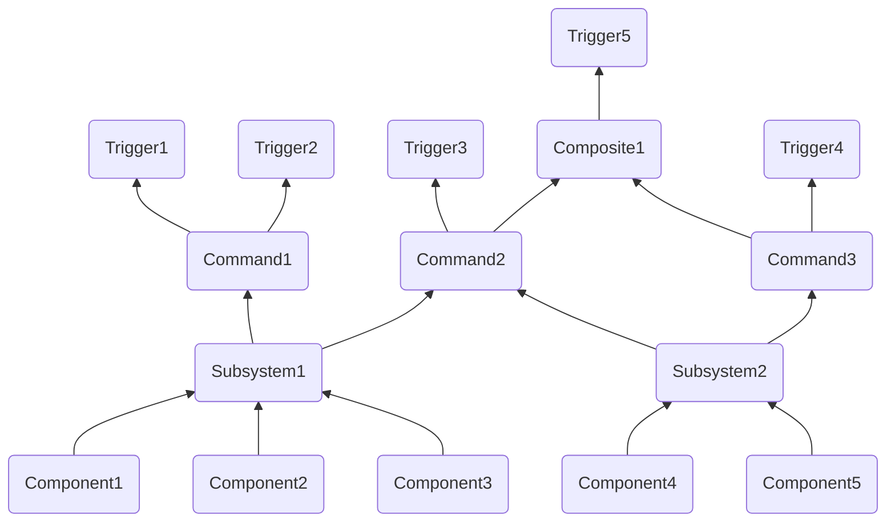

# Command Base Help Document

## Concept Overviews:

- A **component** is a single device on the robot
    - Accessible by a class either built into wpilib or a [3rd party vendor library](Help.md#3rd-party-vendor-libraries) (not user-defined)
    - Lowest level class we work with
    - Examples: `TalonFX`, solenoid, input device such as CANcoder or limit switch
- A **subsystem** is a specific section of the robot, it's used as an interface between components and commands
    - Contains component(s)
    - The only way to access a component, therefore, must contain all of the functionality needed to interface with all components contained by it
    - Each component should be contained in exactly **one** subsystem
        - Otherwise, the built-in protection against multiple values being sent to one subsystem at the same time won't work right (this is handled by the [command scheduler](https://docs.wpilib.org/en/stable/docs/software/commandbased/command-scheduler.html))
    - All components in one subsystem should be used at the same time most of the time 
        - A subsystem can't do multiple things at once, so if you have your drive train in the same subsystem as your shooter, you can't drive and shoot at once, at least not easily
    - Read more on the [docs](https://docs.wpilib.org/en/stable/docs/software/commandbased/subsystems.html)
    - Examples: a drivetrain, a shooter system, an intake system
- A **command** makes something happen, it's used as an interface between subsystems and triggers
    - Contains subsystem(s)
    - Handled by the [Command Scheduler](https://docs.wpilib.org/en/stable/docs/software/commandbased/command-scheduler.html) (determines what commands are run when)
    - Each subsystem can be in multiple commands
        - WPILib handles it, making sure that a subsystem doesn't try to do two things at once
        - Each command has "requirements", the list of subsystems it uses
        - You can make a command interruptible, meaning that if another command with a shared requirement is scheduled, the current command will cancel rather than the other one either waiting or not being run
        - An intake command on Armstrong would require the shooter motors, the arm angling motors, and the intake motors
    - Commands can be formed by other commands in command grouping, these commands are called compositions
        - There are many types of command groups to control the ordering of the commands, read more [here](https://docs.wpilib.org/en/stable/docs/software/commandbased/command-groups.html)
        - As composites are commands, they can be used to form more composites
    - Read more on the [docs](https://docs.wpilib.org/en/stable/docs/software/commandbased/commands.html)
- A **trigger** is some sort of input, it interacts with the command scheduler to call commands
    - The most common type of trigger is a button input
        - Gamepad buttons can be accessed by the [button enum](https://github.wpilib.org/allwpilib/docs/release/cpp/structfrc_1_1_xbox_controller_1_1_button.html)
    - Commands are generally bound to triggers in the `ConfigureButtonBindings` class of `RobotContainer`
    - There are different bindings available for different use cases
    - Triggers can be [composed](https://docs.wpilib.org/en/stable/docs/software/commandbased/binding-commands-to-triggers.html#composing-triggers) so that `&&`, `||`, or `!` can be applied to them
    - Read more on the [docs](https://docs.wpilib.org/en/stable/docs/software/commandbased/binding-commands-to-triggers.html)



## 3rd Party Vendor Libraries

*3rd Party Vendor Libraries* are libraries created by component manufacturers. They are required for the use of some components (for example, the ctre library is required for use of Falcon500 TalonFX's). To install one, [copy the link to the `.json` file](https://docs.wpilib.org/en/stable/docs/software/vscode-overview/3rd-party-libraries.html#libraries), then, in VSCode, press the wpilib icon in the top right and go to `WPILib: Manage Vendor Libraries`>`Install new libraries (online)` and paste the link. Generally you will only need either the ctre or rev library.

## Solenoids

Solenoids are the controllers for air-powered devices, generally pistons. They require an air compressor, which is automatically handled by WPILib (if a solenoid is declared) REFERENCE REQUIRED. We use double solenoids, which have three settings: Forward, Reverse, and Off. The solenoid should never be in Forward or Reverse for longer than a fraction of a second INSERT APPROXIMATE TIME HERE(ASK OLI), just long enough to move the piston. It must then be set to Off again in order to avoid damaging the piston (ask Oli). An example of a Double Solenoid Subsystem and Command is below:
INSERT EXAMPLE HERE


## How to make a...

This section covers how to write a new subsytem, command, and how to bind a command to a trigger. All file paths are in `src > main`
### Subsystem:

1. Ensure that you need a subsytem: a subsystem should be a specific section of a robot. It is used to interface the components included in it. It should generally use all of the included components at once, since it's difficult to use different ones for different purposes at once.

2. Create your files: you'll need a `SubsystemName.h` file in the `include > subsystems` directory, and a `SubsytemName.cpp` file in the `cpp > subsystems` directory. (from now on, `SubsystemName` represents the name of the subsystem, your name should be CamelCase)

3. In `SubsystemName.h` declare methods and components:
```C++
#pragma once

#include <frc2/command/SubsystemBase.h>

class SubsystemName : public frc2::SubsystemBase {
public:
    SubsytemName(); //Constructor

    //Method declarations go here:
    void ExampleMethod1(); //Declare your own methods like so
    double ExampleMethod2(double exampleParameter);

private:
    //subsystem components such as motors:
    WPI_TalonFX ExampleTalonFX;
    WPI_TalonSRX ExampleTalonSRX;
};
```

4. In `SubsytemName.cpp` define methods and components:
```C++
#include "subsystems/SubsytemName.h"

SubsytemName::SubsytemName() : ExampleTalonFX{0}, ExampleTalonSRX{1} {} //constructor, make sure to include all components with their ids, separated by commas

void SubsytemName::ExampleMethod1() {
  ExampleTalonFX.Set(0.5);
}

double SubsytemName::ExampleMethod2(double exampleParameter) {
  ExampleTalonSRX.Set(exampleParameter);
  return 5;
}
```

5. In `RobotContainer.h` (in the `include` directory), make a pointer to your subsystem:
```C++
#pragma once

#include <frc2/command/Command.h>
#include <frc/XboxController.h>

#include "subsystems/SubsytemName.h"

class RobotContainer {
 public:
  RobotContainer();
  
 private:
  frc::XboxController controller{0}; //controller used for bindings
  
  SubsytemName* p_subsytemName; //uses pascalCase as it is an instance, and has the p_ prefix as it is a pointer

  void ConfigureButtonBindings();
};
```

### Command:

1. Ensure you need a command, a command should *do* something, interface with subsystem(s), and is generally scheduled by a button press.

2.  Create your files: you'll need a `CommandName.h` file in the `include > commands` directory, and a `CommandName.cpp` file in the `cpp > commands` directory. (from now on, `CommandName` represents the name of the command, your name should be CamelCase)

3. In `CommandName.h`, declare constructor and methods you plan to use:
```C++
#pragma once

#include <frc2/command/CommandBase.h>
#include <frc2/command/CommandHelper.h>

#include "subsystems/SubsytemName.h" //Subsystem requirements, each should have its own include

class CommandName : public frc2::CommandHelper<frc2::CommandBase, CommandName> {
 public:
  explicit CommandName(SubsytemName* subsystem); //constructor, must take all required subsystems as parameters

    void Initialize() override; //Called once at the beginning, defaults to nothing
  
    //void Execute() override; //Called every frame, defaults to nothing

    void End(bool interrupted) override; //Called once at the end, defaults to nothing
  
    //bool IsFinished() override; //return whether the command has finished, run once per frame, defaults to false (no end until interrupt)
	
 private:
  SubsytemName* subsytemName; //each subsystem needs its own pointer
};
```

4. In `CommandName.cpp`, define methods and constructor:
```C++
#include "commands/CommandName.h"

CommandName::CommandName(SubsytemName* subsystem){ //constructor, takes all required subsystems and adds them to command requirements
	AddRequirements(subsystem); //subsystems must be added to the command's requirements
	subsytemName = new SubsytemName(); //required for each subsystem
}

void CommandName::Initialize() {
	subsytemName->ExampleMethod1();
	subsytemName->ExampleMethod2(0.5);
}

/*void CommandName::Execute() {
    subsystemName->ExampleMethod1(); 
}*/

void CommandName::End(bool interrupted) {
	subsytemName->ExampleMethod2(0.5);
}

/*bool SpinTfx::IsFinished() { //return whether the command should finish this frame

}*/
```

### Button Binding:

1. Ensure that you have "`frc::XboxController controller{0};`" and "`void ConfigureButtonBindings();`" under `private:` in `RobotContainer.h` (you'll need to include `<frc/XboxController.h>`). This instantiates a controller to use for bindings and declares the class for button bindings respectively.

2. In `RobotContainer.cpp`, declare your button bindings (read the [docs](https://docs.wpilib.org/en/stable/docs/software/commandbased/binding-commands-to-triggers.html#trigger-button-bindings) to find the correct binding for the functionality you want to acheive):
```C++
#include "RobotContainer.h"

#include <frc2/command/button/JoystickButton.h>
#include <frc/XboxController.h> //used for enumerators

using frc::XboxController;
using namespace frc2;

RobotContainer::RobotContainer() {
  ConfigureButtonBindings();
}

void RobotContainer::ConfigureButtonBindings() {
    // Configure your button bindings to commands here
	JoystickButton(&controller, XboxController::Button::kA).WhenHeld(CommandName(p_subsystemName)); //declare a joystick button using the enumerator of the a button of `controller` (remember the &), then call `.WhenHeld()`, a binding that schedules the command when you hit the button and cancels it when you release it, `.WhenHeld()` takes a command, which takes subsytem pointers according to its constructor, the subsytems should be declared in the header already

    JoystickButton(&controller, XboxController::Button::kB)
        .WhenActive(CommandName(p_subsytemName))
        .WhileHeld(CommandName2(p_subsystemName)); //bindings return the original button, so they can be chained together

    (JoystickButton(&controller, XboxController::Button::kX)
        || JoystickButton(&controller, XboxController::Button::kY))
        .WhileActiveOnce(CommandName(p_subsystemName)); //trigger composition, if either is pressed, CommandName will be scheduled (must use WhileActiveOnce() rather than whenHeld() because composition returns a trigger, not a button)
}
```


TODO: common component references, structure of subsystems commands and `RobotContainer` 