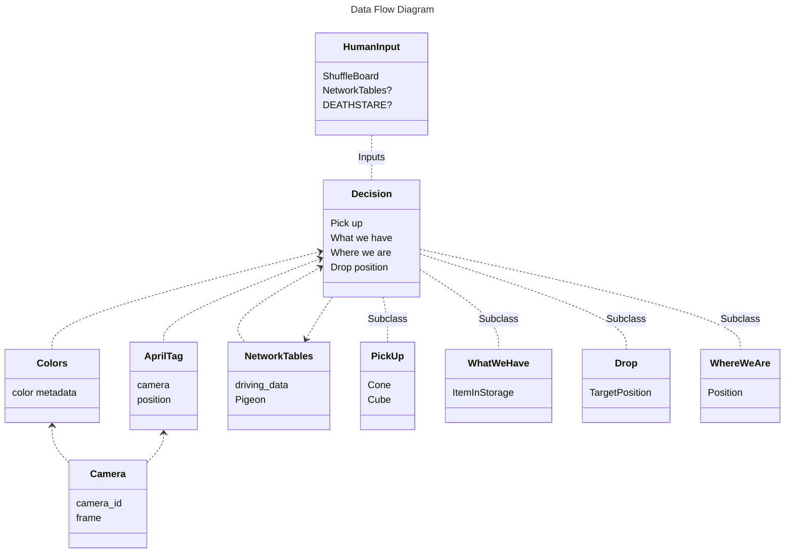

# Python based robot control

```mermaid
---
title: Data Flow Diagram
---
classDiagram
    Colors <.. Camera
    AprilTag <.. Camera
    Decision <.. AprilTag
    Decision <.. Colors
    Decision <.. NetworkTables
    NetworkTables <.. Decision
    Decision .. PickUp : Subclass
    Decision .. WhatWeHave : Subclass
    Decision .. Drop : Subclass
    Decision .. WhereWeAre : Subclass
    HumanInput .. Decision : Inputs
    class Camera{
      camera_id
      frame
    }
    class Colors{
      color metadata
    }
    class AprilTag{
      camera
      position
    }
    class NetworkTables{
      driving_data
      Pigeon
    }
    class Decision{
      Pick up
      What we have
      Where we are
      Drop position
    }
    class PickUp{
      Cone
      Cube
    }
    class WhatWeHave{
      ItemInStorage
    }
    class Drop{
      TargetPosition
    }
    class WhereWeAre{
      Position
    }  
    class HumanInput{
        ShuffleBoard
        NetworkTables?
        DEATHSTARE?
    }
```
